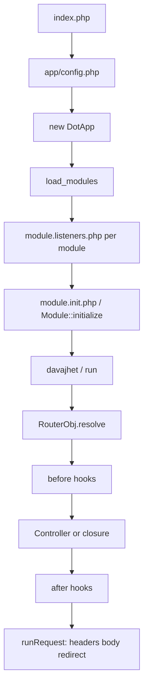

# 01 — Architecture

## Request lifecycle



### Boot order (simplified)

1. `index.php` sets `__ROOTDIR__`, includes `app/config.php`.
2. `config.php` registers drivers, creates `$dotApp = new DotApp()`, calls `$dotApp->load_modules()` (unless maintenance).
3. For each request, resolve the **listener** route map and include matching `module.listeners.php` files **first**. Then resolve the **module** route map and include matching `module.init.php` / instantiate `Module`. The two maps are independent (`Listeners::initializeRoutes()` may differ from `Module::initializeRoutes()`). An omitted / `null` listener map inherits the module map — old modules stay compatible.
4. Framework default routes (e.g. `/assets/{modul}/{cesta*}`) register.
5. `$dotApp->davajhet()` (= `run()`) resolves the route and sends the response.

### Module init details

`Module::__construct` fires:

- `dotapp.module.{name}.init.start`
- optional condition via `initializeCondition` / listener
- `initialize($dotApp)` — **register routes here**
- `dotapp.module.{name}.init.end`

`Module::initializeRoutes()` returns URL patterns used by `modulesAutoLoader.php` (created via `php dotapper.php --optimize-modules`) for full module initialization. `Listeners::initializeRoutes()` may return a different list for callback registration; omitting it (or returning `null`) inherits the module routes. Optimizer format v2 keeps legacy `$modules`, adds `$listeners`, and sets `$modulesAutoLoaderVersion = 2`. Runtime falls back to `$modules` when it reads an old file. A map containing `['*']` wakes that part on every URL — **MUST NOT** copy it unless the product really needs a global hook ([03](03-MODULES-AND-ROUTING.md)).

---

## Project folder map

```
project-root/
  index.php                 # front controller — FORBIDDEN even if asked
  dotapper.php              # CLI — FORBIDDEN even if asked
  .htaccess
  app/
    config.php              # ALLOWED
    DotApp.php              # FORBIDDEN — even if asked (kernel frozen)
    listeners.php           # ASK FIRST
    parts/                  # FORBIDDEN — even if asked (core libraries)
    modules/                # your modules live here
      MyModule/             # ALLOWED (own module only)
    runtime/                # FORBIDDEN — cache/logs
    vendor/                 # FORBIDDEN
  assets/
    modules/                # rewrite target for module assets
```

---

## Module anatomy

```
app/modules/MyModule/
  module.init.php           # Module class + routes + config defaults
  module.listeners.php      # early hooks (before init)
  Installation.php          # optional versioned migrations
  install.php               # one-shot; renamed to installed_<hash>_install.php after run — rename BACK after a new version
  .hooks                    # Markdown docs of Events::trigger names (not a public page; see 41)
  Api/Api.php               # optional API controller stub
  Controllers/*.php
  Middleware/*.php
  Models/*.php
  Libraries/                # optional PHP libraries (no generator)
  views/
    *.view.php
    layouts/*.layout.php
  assets/                   # public via /assets/modules/MyModule/...
  translations/*.json
  tests/*Test.php
  AI_RULES.md               # short pointer to /AIRULES (Dotapper no longer writes *_AI_guide.md)
```

### Namespaces

| Artifact | Namespace |
|----------|-----------|
| Module / Listeners | `Dotsystems\App\Modules\{ModuleName}` |
| Controllers | `Dotsystems\App\Modules\{ModuleName}\Controllers` |
| Middleware | `Dotsystems\App\Modules\{ModuleName}\Middleware` |
| Models | `Dotsystems\App\Modules\{ModuleName}\Models` |
| Api | `Dotsystems\App\Modules\{ModuleName}\Api` |

---

## Callable string grammar

Used in routes, `DotApp::call()`, middleware hooks:

| Form | Resolves to |
|------|-------------|
| `MyModule:Home@index!` | `...\Controllers\Home::index` without DI |
| `MyModule:Home@index` | same with DI reflection |
| `#MyModule:Gate@check!` | `...\Middleware\Gate::check` |
| `*MyModule:Item@get!` | `...\Models\Item::get` |
| Closure | DI-injected or `NoDI` wrapped |

Trailing `!` = skip DI. When using `!`, **do not** type-hint injectable services in the method signature — create them manually (`Renderer::new()`, facades, etc.).

---

## Key facades / entry points

| Facade | Use for |
|--------|---------|
| `Router` / `Route` | Register routes (`Route` is alias of `Router`) |
| `Request` | Request helpers |
| `Response` | JSON, redirect helpers |
| `DB` | Database |
| `Config` | Configuration |
| `Auth` | Authentication |
| `Crypto` | Encrypt/decrypt |
| `Events` | Event bus (`trigger` / `triggerWithVeto`) |
| `Veto` | Opt-in stop object — **only** with `triggerWithVeto()` ([12](12-SERVICES.md) §2, [41](41-MODULE-HOOKS.md)) |
| `Renderer` | Templates |
| `Translator` | i18n |
| `Cache` / `Logger` | Cache / logs |
| `DSM` | Session store — **MUST** `DSM::use('Shop')`; never `$_SESSION` |

Canonical singleton: `DotApp::dotApp()` / `DotApp::DotApp()`.

---

## Built-in events (selection)

| Event | When |
|-------|------|
| `dotapp.catchall` | **Core** — every `trigger()` except itself. Debug funnel. See below. |
| `dotapp.load_modules.override` | Before module scan |
| `dotapp.modules.loaded` | After all modules loaded |
| `dotapp.module.{name}.init.start/end` | Module ctor |
| `dotapp.module.{name}.install` | Before one-shot `install.php` |
| `dotapp.router.resolve` | Start of routing (alias `dotapp.middleware`) |
| `dotapp.router.resolve.404` | No route matched |

Event names are lowercased on register/trigger. `trigger()` **ignores** listener return values. `triggerWithVeto()` stops only on `Dotsystems\App\Parts\Veto` and returns `Veto|null`.

### `dotapp.catchall` — core debug funnel (DotApp 2.0)

`DotApp::trigger()` **always** fires `dotapp.catchall` first (then the named event). The core **skips** that extra hop when the name is already `dotapp.catchall`, so it cannot recurse.

Listener arity is **not** the same as the original event:

```php
// Events::trigger('module.shop.sms_sent.hook', $payload, $itemId);
Events::on('dotapp.catchall', function ($result, $eventname, ...$data) {
    // $result    = $payload
    // $eventname = 'module.shop.sms_sent.hook'  (already lowercased)
    // $data      = [$itemId]
});
```

**Building a debugger / event tracer (MUST use this):** one listener sees **every** event in the request (boot, router, `dotapp.log`, your module events, and `dotapp.catch` reports). Gate it with a debug flag. Keep the body cheap and in **your** `try/catch` — a throw here **aborts the original event** (catchall runs first). **MUST NOT** `Events::trigger('dotapp.catchall', …)` yourself, trigger other events from the listener (nested catchalls), persist every event in production, or put secrets from `$result`/`$data` into a log ([24](24-ATTACK-VECTORS.md) §8). Canonical: [12](12-SERVICES.md) §2, [23](23-DEBUG-PLAYBOOK.md) §1c.

**Project convention (MUST):** `dotapp.catch` + `dotapp.catch.error` / `dotapp.catch.info` are **not** fired by the core — **your** modules fire them from every `catch` and every `execute()` error callback (structured **failures**). Payload contract: [18](18-ERROR-HANDLING-AND-RETURN-VALUES.md) §9. A debug tool typically listens to **both**: `catchall` = all events, `catch` = failures only.

**Your module’s business hooks (MUST judge):** name **`module.{lowercase_modulename}.{hook_name}.hook`**. Fire when another module could log/history/sync — **MUST NOT** on every save. List every fired name in **`app/modules/<YourModule>/.hooks`**. Listen in **your** `module.listeners.php` after reading the owner’s `.hooks` — do not patch the other module. Canonical: [41](41-MODULE-HOOKS.md). Sample: [EX-16](examples/EX-16-module-hooks.md).

---

## What this framework is not

- No `routes/web.php` files.
- No Eloquent ActiveRecord by default.
- No Blade/Twig.
- No global automatic CSRF middleware on every POST (use `crcCheck` **once** in the handler + secure forms / Input groups — **MUST NOT** middleware `crcCheck` + controller `crcCheck`).
- No named routes / `route('name')`.

Continue: [03-MODULES-AND-ROUTING.md](03-MODULES-AND-ROUTING.md), [04-CONTROLLERS-AND-RESPONSES.md](04-CONTROLLERS-AND-RESPONSES.md).
