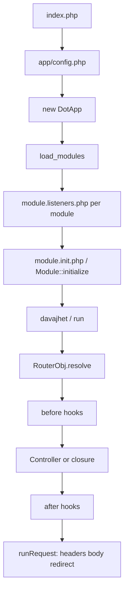

# 01 — Architecture

## Request lifecycle



### Boot order (simplified)

1. `index.php` sets `__ROOTDIR__`, includes `app/config.php`.
2. `config.php` registers drivers, creates `$dotApp = new DotApp()`, calls `$dotApp->load_modules()` (unless maintenance).
3. For each module directory under `app/modules/<Name>/`:
   - include `module.listeners.php` **first** (if present),
   - then include `module.init.php` / instantiate `Module`.
4. Framework default routes (e.g. `/assets/{modul}/{cesta*}`) register.
5. `$dotApp->davajhet()` (= `run()`) resolves the route and sends the response.

### Module init details

`Module::__construct` fires:

- `dotapp.module.{name}.init.start`
- optional condition via `initializeCondition` / listener
- `initialize($dotApp)` — **register routes here**
- `dotapp.module.{name}.init.end`

`initializeRoutes()` returns URL patterns used by `modulesAutoLoader.php` (created via `php dotapper.php --optimize-modules`) for lazy loading.

---

## Project folder map

```
project-root/
  index.php                 # front controller — FORBIDDEN to edit
  dotapper.php              # CLI — FORBIDDEN to edit
  .htaccess
  app/
    config.php              # ALLOWED
    DotApp.php              # FORBIDDEN
    listeners.php           # ASK FIRST
    parts/                  # FORBIDDEN — core libraries
    modules/                # your modules live here
      MyModule/             # ALLOWED (own module only)
    runtime/                # FORBIDDEN — cache/logs
    vendor/                 # FORBIDDEN
  assets/
    modules/                # rewrite target for module assets
```

---

## Module anatomy

```
app/modules/MyModule/
  module.init.php           # Module class + routes + config defaults
  module.listeners.php      # early hooks (before init)
  Installation.php          # optional versioned migrations
  install.php               # one-shot; renamed to installed_<hash>_install.php after run
  Api/Api.php               # optional API controller stub
  Controllers/*.php
  Middleware/*.php
  Models/*.php
  Libraries/                # optional PHP libraries (no generator)
  views/
    *.view.php
    layouts/*.layout.php
  assets/                   # public via /assets/modules/MyModule/...
  translations/*.json
  tests/*Test.php
  AI_RULES.md               # short pointer to /AIRULES (Dotapper no longer writes *_AI_guide.md)
```

### Namespaces

| Artifact | Namespace |
|----------|-----------|
| Module / Listeners | `Dotsystems\App\Modules\{ModuleName}` |
| Controllers | `Dotsystems\App\Modules\{ModuleName}\Controllers` |
| Middleware | `Dotsystems\App\Modules\{ModuleName}\Middleware` |
| Models | `Dotsystems\App\Modules\{ModuleName}\Models` |
| Api | `Dotsystems\App\Modules\{ModuleName}\Api` |

---

## Callable string grammar

Used in routes, `DotApp::call()`, middleware hooks:

| Form | Resolves to |
|------|-------------|
| `MyModule:Home@index!` | `...\Controllers\Home::index` without DI |
| `MyModule:Home@index` | same with DI reflection |
| `#MyModule:Gate@check!` | `...\Middleware\Gate::check` |
| `*MyModule:Item@get!` | `...\Models\Item::get` |
| Closure | DI-injected or `NoDI` wrapped |

Trailing `!` = skip DI. When using `!`, **do not** type-hint injectable services in the method signature — create them manually (`Renderer::new()`, facades, etc.).

---

## Key facades / entry points

| Facade | Use for |
|--------|---------|
| `Router` / `Route` | Register routes (`Route` is alias of `Router`) |
| `Request` | Request helpers |
| `Response` | JSON, redirect helpers |
| `DB` | Database |
| `Config` | Configuration |
| `Auth` | Authentication |
| `Crypto` | Encrypt/decrypt |
| `Events` | Event bus |
| `Renderer` | Templates |
| `Translator` | i18n |
| `Cache` / `Logger` | Cache / logs |
| `DSM` | Session store — **MUST** `DSM::use('Shop')`; never `$_SESSION` |

Canonical singleton: `DotApp::dotApp()` / `DotApp::DotApp()`.

---

## Built-in events (selection)

| Event | When |
|-------|------|
| `dotapp.load_modules.override` | Before module scan |
| `dotapp.modules.loaded` | After all modules loaded |
| `dotapp.module.{name}.init.start/end` | Module ctor |
| `dotapp.module.{name}.install` | Before one-shot `install.php` |
| `dotapp.router.resolve` | Start of routing (alias `dotapp.middleware`) |
| `dotapp.router.resolve.404` | No route matched |

Event names are lowercased on register/trigger.

---

## What this framework is not

- No `routes/web.php` files.
- No Eloquent ActiveRecord by default.
- No Blade/Twig.
- No global automatic CSRF middleware on every POST (use `crcCheck` + secure forms / Input groups).
- No named routes / `route('name')`.

Continue: [03-MODULES-AND-ROUTING.md](03-MODULES-AND-ROUTING.md), [04-CONTROLLERS-AND-RESPONSES.md](04-CONTROLLERS-AND-RESPONSES.md).
